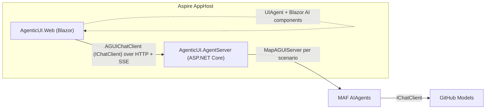

# AgenticUI — AG-UI for .NET

A hands-on tour of **AG-UI** (the [Agent User Interaction Protocol](https://docs.ag-ui.com))
in .NET. The backend hosts agents built with the **Microsoft Agent Framework (MAF)** and the
**AG-UI C# SDK**; the frontend is a **Blazor** app that consumes them with the new
in-progress Blazor AI components. [.NET Aspire](https://learn.microsoft.com/dotnet/aspire/)
wires the two together, and everything runs on **free [GitHub Models](https://github.com/marketplace/models)** —
no paid Azure or OpenAI resources required.

## What it demonstrates

| Scenario | AG-UI feature | Endpoint |
| --- | --- | --- |
| **Agentic chat** | Streaming, multi-turn chat (`TEXT_MESSAGE_*`) | `/agentic_chat` |
| **Backend tools** | Server-side tool calls (`TOOL_CALL_*`) rendered as a custom card | `/backend_tool_rendering` |
| **Frontend tools** | Client-side tool executed in the browser | `/tool_based_generative_ui` |
| **Human in the loop** | Tool approval interrupt → Approve / Reject → resume | `/human_in_the_loop` |
| **Shared state** | Structured state via `STATE_SNAPSHOT` | `/shared_state` |
| **Predictive state** | A document streamed live via progressive `STATE_SNAPSHOT`s | `/predictive_state_updates` |
| **Agentic generative UI** | Live plan via `STATE_SNAPSHOT` + `STATE_DELTA` (JSON Patch) | `/agentic_generative_ui` |

## Architecture



- **`AgenticUI.AgentServer`** — ASP.NET Core app. Uses
  `Microsoft.Agents.AI.Hosting.AGUI.AspNetCore` (`AddAGUIServer()` + `MapAGUIServer("/route", agent)`)
  to expose one AG-UI endpoint per scenario. Agents are MAF `AIAgent`s backed by GitHub Models via
  `Microsoft.Agents.AI.OpenAI`.
- **`AgenticUI.Web`** — Blazor Web App (Interactive Server). Each scenario builds a `UIAgent` over an
  `AGUIChatClient` (from the AG-UI C# SDK's `AGUI.Client`), which turns an AG-UI endpoint into a
  standard `IChatClient`. UI is rendered with the Blazor AI components (`ChatPage`, `MessageList`,
  `BlockRenderer`, `UIAgent<TState>`, …).
- **`AgenticUI.AppHost` / `AgenticUI.ServiceDefaults`** — Aspire orchestration and service discovery.

### Released packages used

Everything except the Blazor AI components uses released NuGet packages:

- `Microsoft.Agents.AI`, `Microsoft.Agents.AI.OpenAI` (1.15.0)
- `Microsoft.Agents.AI.Hosting.AGUI.AspNetCore` (1.15.0-preview — the AG-UI hosting glue is still preview)
- `AGUI.Client`, `AGUI.Abstractions`, `AGUI.Server` (0.0.4 — the AG-UI C# SDK)
- `.NET Aspire` (13.4)

### The one exception: Blazor AI components

The Blazor AI components (`Microsoft.AspNetCore.Components.AI`) are **in progress** in
[dotnet/aspnetcore#67673](https://github.com/dotnet/aspnetcore/pull/67673) and not yet published to
NuGet. To keep this sample **standalone**, a source snapshot is vendored under
[`src/vendor/`](src/vendor/Microsoft.AspNetCore.Components.AI/NOTICE.md) (MIT-licensed, with
provenance). The assembly and namespace match the upstream package, so swapping to the official
NuGet package later is a one-line change. Refresh the snapshot with
[`eng/sync-components-ai.ps1`](eng/sync-components-ai.ps1).

## Running it

### Prerequisites

- [.NET 10 SDK](https://dotnet.microsoft.com/download/dotnet/10.0)
- [.NET Aspire CLI](https://learn.microsoft.com/dotnet/aspire/) (or just `dotnet run` the AppHost)
- A **GitHub token with the `models` permission**. The GitHub CLI token works:
  `gh auth token` (with the `models:read` scope).

### Configure the GitHub Models token

Set it as an AppHost user-secret (recommended):

```bash
dotnet user-secrets set "Parameters:github-token" "$(gh auth token)" --project src/AgenticUI.AppHost
```

The model defaults to `openai/gpt-4o-mini`; override with `Parameters:github-model`.

### Run

```bash
dotnet run --project src/AgenticUI.AppHost
```

Open the Aspire dashboard, then open the **web** resource and pick a scenario from the nav.

## Repository layout

```
src/
  AgenticUI.AppHost/          Aspire orchestration
  AgenticUI.ServiceDefaults/  Shared service defaults
  AgenticUI.AgentServer/      AG-UI backend (MAF + AG-UI C# SDK)
  AgenticUI.Web/              Blazor front end (Blazor AI components)
  vendor/                     Vendored in-progress Blazor AI components
docs/
  blog-post.md               Draft blog post summarizing the AG-UI scenarios
  findings.md                Bugs / issues found while building this sample
eng/
  sync-components-ai.ps1     Refresh the vendored components snapshot
```

## Notes & findings

See [`docs/findings.md`](docs/findings.md) for issues discovered while building this sample against
the freshly shipped packages (including a couple of real bugs in the samples/SDK).
