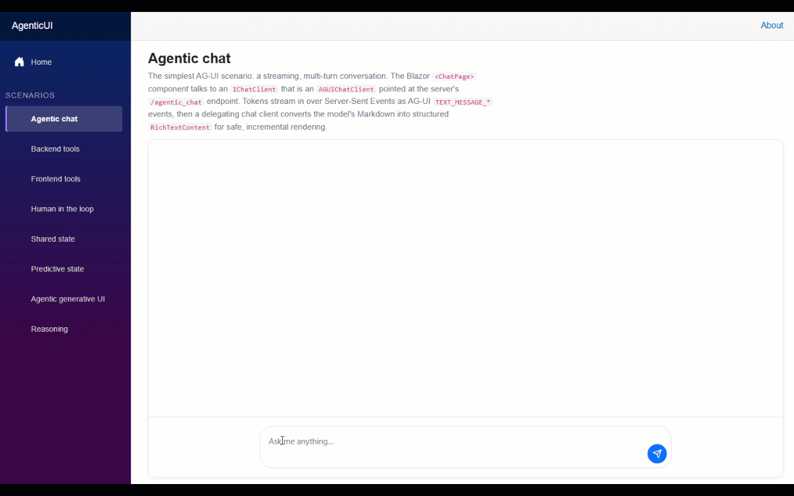
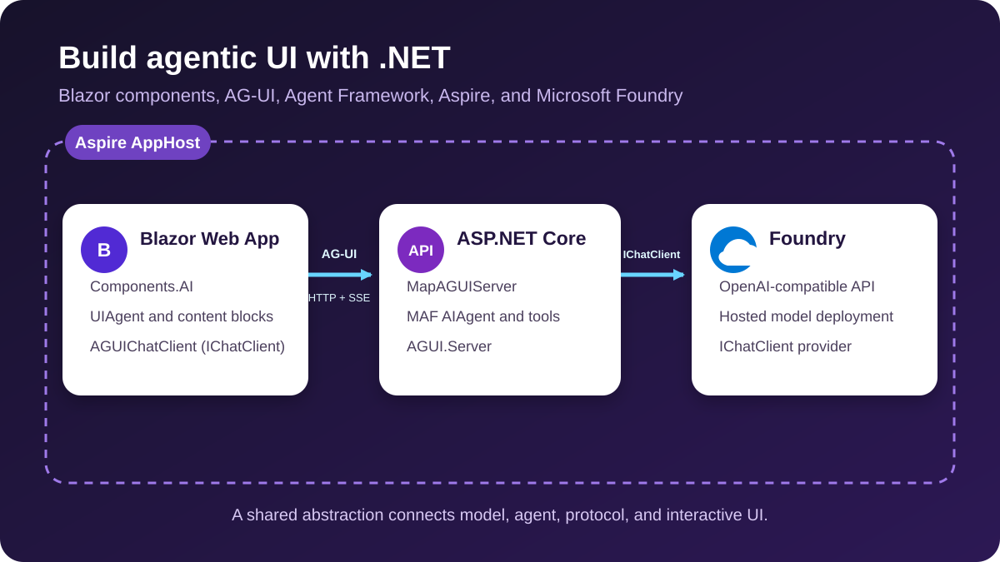

# Building agentic UI with .NET

This sample demonstrates how to build rich agentic user experiences with .NET. A **Blazor** chat experience provides a flexible conversational foundation, and the scenarios extend it with structured rich text, tool-driven UI, human approval, shared and predictive state, generative UI, and visible reasoning. The backend hosts agents built with the **Microsoft Agent Framework (MAF)**, while the **[AG-UI](https://docs.ag-ui.com) C# SDK** carries messages, actions, and state between the agents and the preview [Blazor AI components](https://learn.microsoft.com/aspnet/core/release-notes/aspnetcore-11#experimental-blazor-ai-components-for-agentic-user-interfaces). [Aspire](https://learn.microsoft.com/dotnet/aspire/) wires the application together, and the agents use **[Microsoft Foundry](https://learn.microsoft.com/azure/ai-foundry/)** for model inference.



## What it demonstrates

| Scenario | AG-UI feature | Endpoint |
| --- | --- | --- |
| **Agentic chat** | Streaming, multi-turn chat (`TEXT_MESSAGE_*`) rendered as structured rich text | `/agentic_chat` |
| **Backend tools** | Server-side tool calls (`TOOL_CALL_*`) mapped to a generated typed block and custom card | `/backend_tool_rendering` |
| **Frontend tools** | Client-side UI action automatically invoked from a custom renderer | `/tool_based_generative_ui` |
| **Human in the loop** | Tool approval interrupt → Approve / Reject → resume | `/human_in_the_loop` |
| **Shared state** | Bidirectional typed state via request state and `STATE_SNAPSHOT` | `/shared_state` |
| **Predictive state** | Proposed document edits with accept/reject and rollback | `/predictive_state` |
| **Agentic generative UI** | Live plan via `STATE_SNAPSHOT` + `STATE_DELTA` (JSON Patch) | `/agentic_generative_ui` |
| **Reasoning** | Reasoning summaries via `REASONING_*` events and a custom activity block | `/reasoning` |

## Architecture



- **`AgenticUI.AgentServer`** — ASP.NET Core app. Uses `Microsoft.Agents.AI.Hosting.AGUI.AspNetCore` (`AddAGUIServer()` + `MapAGUIServer("/route", agent)`) to expose one AG-UI endpoint per scenario. Agents are MAF `AIAgent`s backed by Microsoft Foundry via `Microsoft.Agents.AI.OpenAI`.
- **`AgenticUI.Web`** — Blazor Web App (Interactive Server). Each scenario builds a `UIAgent` over an `AGUIChatClient` (from the AG-UI C# SDK's `AGUI.Client`), which turns an AG-UI endpoint into a standard `IChatClient`. UI is rendered with the Blazor AI components (`ChatPage`, `MessageList`, `BlockRenderer`, `UIAgent<TState>`, …).
- **`AgenticUI.AppHost` / `AgenticUI.ServiceDefaults`** — Aspire orchestration and service discovery.

### Packages used

- `Microsoft.Agents.AI`, `Microsoft.Agents.AI.OpenAI` (1.15.0)
- `Microsoft.Agents.AI.Hosting.AGUI.AspNetCore` (1.15.0-preview — the AG-UI hosting glue is still preview)
- `AGUI.Client`, `AGUI.Abstractions`, `AGUI.Formatting`, `AGUI.Server` (0.0.6 — the AG-UI C# SDK)
- `Azure.AI.OpenAI` (2.9.0-beta.1)
- `Microsoft.AspNetCore.Components.AI` (0.1.0-preview.1.26459.102)
- `Aspire` (13.5.3)

## Running it

### Prerequisites

- [.NET 11 RC1 SDK](https://dotnet.microsoft.com/download/dotnet/11.0)
- [Aspire CLI](https://learn.microsoft.com/dotnet/aspire/)
- [Azure CLI](https://learn.microsoft.com/cli/azure/install-azure-cli)
- A **[Microsoft Foundry](https://learn.microsoft.com/azure/ai-foundry/) resource** with a
  `gpt-5-mini` deployment (used for both the general chat and reasoning scenarios).

### Clone and build

```bash
git clone https://github.com/danroth27/AgenticUI.git
cd AgenticUI
dotnet restore
dotnet build
```

### Configure Microsoft Foundry

Sign in to Azure with the identity that has access to the Foundry resource:

```bash
az login
```

The identity must have the **Cognitive Services OpenAI User** role on the Foundry resource. Ask the resource owner or administrator to assign the role if you don't have permission to do so.

Set the existing Foundry account endpoint as an AppHost user-secret:

```bash
dotnet user-secrets set "Parameters:foundry-endpoint" "https://<resource>.services.ai.azure.com/" --project src/AgenticUI.AppHost
```

Use the Foundry resource endpoint, such as `https://<resource>.services.ai.azure.com/`. The AppHost models Foundry as an externally managed HTTPS dependency, so it won't provision or modify the Foundry account. The app authenticates with Microsoft Entra ID through `DefaultAzureCredential`; a deployed AgentServer's managed identity needs the same role as the local developer.

Both deployment names default to `gpt-5-mini`. Override them when your deployment names differ:

```bash
dotnet user-secrets set "Parameters:foundry-model" "<deployment-name>" --project src/AgenticUI.AppHost
dotnet user-secrets set "Parameters:foundry-reasoning-model" "<reasoning-deployment-name>" --project src/AgenticUI.AppHost
```

> **Why a separate reasoning path?** Reasoning models only return their reasoning summaries through
> the OpenAI **Responses** API — chat completions spend the same reasoning tokens but return no
> reasoning text. So the reasoning scenario builds its client with `GetResponsesClient()` and opts in
> via the provider-neutral `ChatOptions.Reasoning`
> (`new ReasoningOptions { Output = ReasoningOutput.Full }`). `Microsoft.Extensions.AI` maps that to
> the Responses API's reasoning summary setting and surfaces the summaries as `TextReasoningContent`,
> which the MAF AG-UI adapter emits as `REASONING_*` events.

### Run

```bash
aspire run
```

Open the Aspire dashboard, then open the **web** resource and pick a scenario from the nav.

### Troubleshooting

- **No Microsoft Foundry endpoint configured:** Set the `Parameters:foundry-endpoint` AppHost user-secret shown above.
- **Authentication failures:** Run `az login` again and verify that the selected identity has the **Cognitive Services OpenAI User** role.
- **Model deployment not found:** Set `Parameters:foundry-model` and `Parameters:foundry-reasoning-model` to the deployment names configured in your Foundry account.

## Repository layout

```text
src/
  AgenticUI.AppHost/          Aspire orchestration
  AgenticUI.ServiceDefaults/  Shared service defaults
  AgenticUI.AgentServer/      AG-UI backend (MAF + AG-UI C# SDK)
  AgenticUI.Web/              Blazor front end (Blazor AI components)
docs/
  findings.md                Current implementation findings and limitations
```

## Notes & findings

See [`docs/findings.md`](docs/findings.md) for current implementation notes, design boundaries, and remaining limitations.
