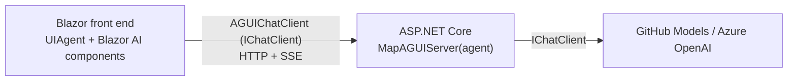

# Build agentic UIs in .NET with AG-UI, the Microsoft Agent Framework, and Blazor

AI agents are only as useful as the experiences you build around them. A great agent that streams
tokens into a textarea is fine — but modern "agentic" apps do much more: they call tools, render rich
generative UI, pause for your approval, and keep structured state in sync between the model and the
screen. Doing that well needs a *protocol* between your agent and your UI.

That protocol is **AG-UI** — the [Agent User Interaction Protocol](https://docs.ag-ui.com) — and it now
has first-class **.NET** support. In this post we'll tour what's possible today using:

- the **[AG-UI C# SDK](https://github.com/ag-ui-protocol/ag-ui)** (`AGUI.Client`, `AGUI.Server`,
  `AGUI.Abstractions`),
- the **Microsoft Agent Framework (MAF)** AG-UI hosting
  (`Microsoft.Agents.AI.Hosting.AGUI.AspNetCore`),
- **Blazor** with the new in-progress Blazor AI components, and
- **.NET Aspire** to run it all.

Everything below runs on **free [GitHub Models](https://github.com/marketplace/models)** — no paid
Azure or OpenAI account needed. The full sample is on GitHub:
**[danroth27/AgenticUI](https://github.com/danroth27/AgenticUI)**.

## What is AG-UI?

AG-UI is an open, transport-agnostic protocol that standardizes the event stream between an agent and a
front end. Instead of every app inventing its own message format, an AG-UI agent emits a well-defined
stream of events over HTTP + Server-Sent Events:

- run lifecycle — `RUN_STARTED`, `RUN_FINISHED`, `RUN_ERROR`
- text — `TEXT_MESSAGE_START` / `CONTENT` / `END`
- tools — `TOOL_CALL_START` / `ARGS` / `END` / `RESULT`
- state — `STATE_SNAPSHOT`, `STATE_DELTA`
- reasoning, custom, and more.

Because it's a shared protocol, the same wire format works across the TypeScript, Python, and now **C#**
SDKs — and across UI toolkits like CopilotKit and Blazor.

The best part for .NET developers: the C# SDK is built on **`Microsoft.Extensions.AI`**. On the server,
your agent is just an `IChatClient` (or a MAF `AIAgent`). On the client, an AG-UI endpoint *is* an
`IChatClient`. That single abstraction is the whole integration story.

## The shape of an AG-UI app in .NET



### The server: expose an agent over AG-UI

Add the hosting package and map an agent to a route:

```csharp
builder.Services.AddAGUIServer();

// Any MAF AIAgent works. Here, an OpenAI-compatible client (GitHub Models).
var chatClient = new OpenAIClient(
        new ApiKeyCredential(githubToken),
        new OpenAIClientOptions { Endpoint = new Uri("https://models.github.ai/inference") })
    .GetChatClient("openai/gpt-4o-mini");

var agent = chatClient.AsAIAgent(name: "AgenticChat", instructions: "You are a helpful assistant.");

app.MapAGUIServer("/agentic_chat", agent);
```

`MapAGUIServer` creates a `POST` endpoint that accepts a `RunAgentInput` and streams AG-UI events back
as SSE. That's the entire backend for a streaming chat agent.

### The client: consume an AG-UI endpoint as an `IChatClient`

```csharp
var chatClient = new AGUIChatClient(new AGUIChatClientOptions(httpClient, "/agentic_chat"));
```

`AGUIChatClient` is an `IChatClient`, so any Microsoft.Extensions.AI-aware UI can drive it. In Blazor,
we wrap it in a `UIAgent` and hand it to a component:

```razor
@code {
    UIAgent _agent = new(chatClient);
}
<ChatPage Agent="_agent" />
```

## The scenarios

The sample implements seven AG-UI scenarios, each on its own page and its own endpoint.

### 1. Agentic chat

Streaming, multi-turn conversation. `<ChatPage>` renders the transcript and streams tokens as
`TEXT_MESSAGE_CONTENT` events arrive.

### 2. Backend tools

The agent calls a **server-side** tool. Add it to the agent:

```csharp
chatClient.AsAIAgent(
    name: "BackendToolRenderer",
    tools: [AIFunctionFactory.Create(GetWeather, name: "get_weather",
        description: "Get the weather for a given location.")]);
```

The tool runs on the server; its call and result stream to the browser as `TOOL_CALL_*` events. On the
client, a `BlockRenderer<FunctionInvocationContentBlock>` turns the `get_weather` invocation into a
custom weather **card** instead of raw JSON — a taste of generative UI:

```razor
<MessageList>
    <BlockRenderer TBlock="FunctionInvocationContentBlock" When="@(b => b.ToolName == "get_weather")">
        <div class="weather-card">☀️ @GetLocation(context) — @ReadWeather(context).Temperature°C</div>
    </BlockRenderer>
</MessageList>
```

### 3. Frontend tools

A **client-side** tool that runs in the browser. Register a UI action with the `UIAgent`:

```csharp
var setAccentColor = AIFunctionFactory.Create(
    (string color) => { _accent = color; return $"Accent set to {color}."; },
    name: "set_accent_color", description: "Set the page accent color.");

_agent = new UIAgent(chatClient, options => options.RegisterUIAction(setAccentColor));
```

The model calls it; the Blazor app executes it locally (here, restyling the page). Frontend tools are how
the agent reaches into *your* app — navigate, open a dialog, update local UI — without a server round-trip.

### 4. Human in the loop

Some actions should never run without a human's OK. Wrap the tool in `ApprovalRequiredAIFunction`:

```csharp
AITool bookMeeting = new ApprovalRequiredAIFunction(
    AIFunctionFactory.Create(BookMeeting, name: "book_meeting"));
```

Calling it raises an AG-UI interrupt. The Blazor AI components render **Approve / Reject** buttons and the
run resumes only after you decide — approve, and the agent continues and completes the booking.

### 5. Shared state

The agent and the UI share a **structured object**. The agent produces a recipe as JSON and emits it as a
`STATE_SNAPSHOT`; the client maps it into a strongly-typed `UIAgent<RecipeState>` and renders a live
recipe card that updates as the state changes.

```csharp
options.StateMapper = ctx =>
{
    if (ctx.Update.RawRepresentation is StateSnapshotEvent snap)
    {
        ctx.SetState(snap.Snapshot.Deserialize<RecipeState>());
        return true;
    }
    return false;
};
```

### 6. Predictive state updates

As the agent writes a document, the server streams it progressively as a series of `STATE_SNAPSHOT`
events, so you watch the document being typed in real time — before the tool call even finishes.

### 7. Agentic generative UI

The agent plans work with a `create_plan` tool (a `STATE_SNAPSHOT`) and advances each step with
`update_plan_step` (a `STATE_DELTA` — an RFC 6902 JSON Patch). The UI renders live plan progress, checking
off steps as the agent completes them.

## Running it on free GitHub Models

GitHub Models exposes an OpenAI-compatible endpoint, so it drops straight into `Microsoft.Extensions.AI`.
All you need is a GitHub token with the `models` permission (the GitHub CLI token works):

```bash
dotnet user-secrets set "Parameters:github-token" "$(gh auth token)" --project src/AgenticUI.AppHost
dotnet run --project src/AgenticUI.AppHost
```

Aspire launches the agent server and the Blazor front end and wires them together with service discovery.

## Where this is headed

A few notes on maturity, since these are fresh bits:

- The **AG-UI C# SDK** (`AGUI.*`) and the core **Microsoft Agent Framework** packages are shipping.
- The **MAF AG-UI hosting** package (`Microsoft.Agents.AI.Hosting.AGUI.AspNetCore`) is still **preview**.
- The **Blazor AI components** are **in progress** in
  [dotnet/aspnetcore#67673](https://github.com/dotnet/aspnetcore/pull/67673). The sample checks in a
  local copy of their source so it builds standalone today; when the package ships it's a one-line swap.

The important takeaway: the programming model is stable and simple. On both ends, it's just `IChatClient`.
AG-UI gives you a standard event stream; MAF gives you agents and hosting; Blazor gives you the components
to render it all. Clone **[danroth27/AgenticUI](https://github.com/danroth27/AgenticUI)** and try the
seven scenarios yourself.
