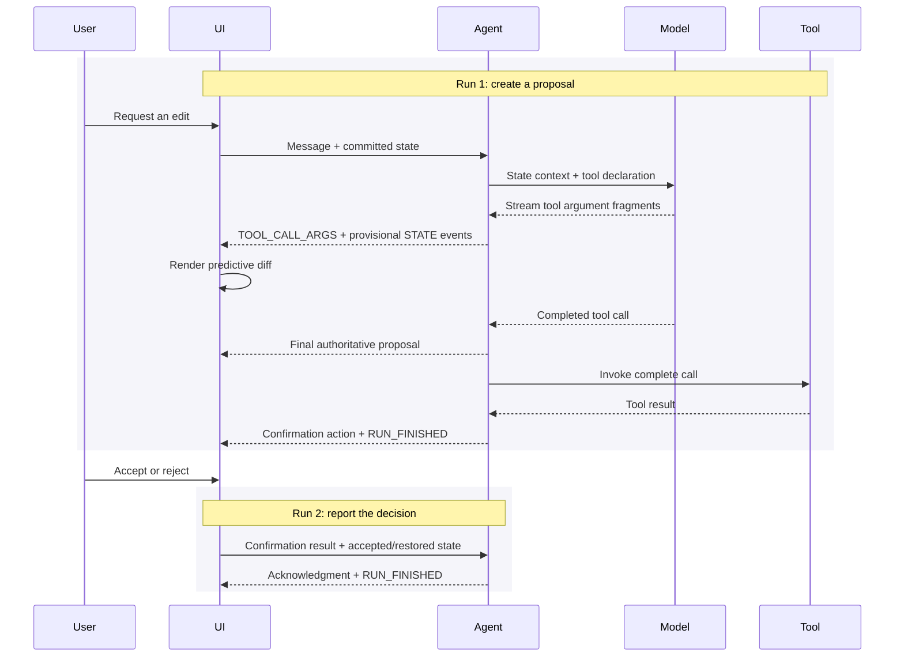
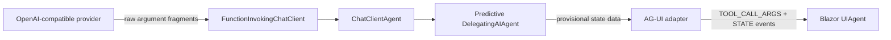

# Predictive state: product requirements and design

Status: Draft

## Summary

Predictive state lets an agent show a proposed application-state change while the model is still
generating it. The user sees immediate progress, but the application retains the committed value
until the proposal is accepted.

The scenario uses general agent and AG-UI primitives:

- An agent calls a tool whose arguments contain proposed state.
- Argument progress becomes provisional state events.
- The completed tool-call arguments are the authoritative proposal.
- A separate interaction accepts or rejects that proposal.

Predictive state is an AG-UI application pattern, not a new kind of agent or a MEAI/MAF concept.

## User scenario

A user is editing a Markdown document with an AI assistant.

1. The user writes or edits the document directly.
2. The user asks the agent to make a change.
3. The agent calls `write_document_local` with the complete proposed document.
4. The document preview and diff update while the argument is generated.
5. When generation completes, the application asks the user to accept or reject the proposal.
6. Accept commits the proposal; reject restores the previous document.

This design intentionally scopes the initial implementation to a single string-valued tool
argument. Progressively mapping arbitrary object or array arguments requires a tolerant partial-JSON
projection component that neither current implementation provides generally.

## Requirements

### Product behavior

| Phase | Expected behavior |
| --- | --- |
| Idle | Show committed state and allow direct edits |
| Generating | Lock conflicting edits and render provisional state |
| Complete | Reconcile with the completed tool arguments and request confirmation |
| Accepted | Commit the proposal and send the decision in a follow-up run |
| Rejected | Restore the baseline and send the decision in a follow-up run |
| Cancelled or failed | Restore committed state and surface the interruption |

### Functional and quality requirements

- Send the current committed document with each edit request.
- Treat client state as untrusted data; validate it and clearly separate it from instructions.
- Render argument progress as provisional state without changing the committed value.
- Treat completed tool-call arguments as authoritative.
- Keep every tool call and result balanced in conversation history.
- Correlate calls by stable identity, including across reused provider indexes.
- Reject or define concurrent writes to the same document.
- Preserve valid AG-UI text, tool, state, and run event ordering.
- Stop model streaming and background producers when the client cancels.
- Throttle intermediate updates; full growing values have cumulative quadratic payload cost.
- Show pre-approval argument progress only when the preview itself is safe and provisional.
  Consequential side-effect tools should suppress predictive rendering until the application defines
  an appropriate policy.
- Isolate provider-specific extraction so it can later be replaced.

### Non-goals

- Expose hidden model reasoning.
- Invoke a tool before its arguments are complete.
- Automatically infer which arguments represent state.
- Define predictive state as a first-class MEAI or MAF feature.
- Provide general incremental parsing for every JSON shape in the initial scenario.

## Agent and protocol design

### Agent contract

The agent calls:

```text
write_document_local(document: string) -> "Document written."
```

The streamed `document` argument is provisional state. The completed `FunctionCallContent`
arguments are the authoritative proposal. The tool result preserves normal function-calling
history but does not define the proposed value.

### AG-UI lifecycle

Confirmation requires two protocol runs.



The client retains:

- **Committed state**: the last accepted document.
- **Predictive state**: the latest provisional document.
- **Baseline state**: the committed document at run start, used for diff and rollback.

## Current .NET development experience

### Recommended implementation

For the current Foundry Chat Completions stack:



The application:

1. Sends committed state through `RunAgentInput.State`.
2. Uses a delegating agent to validate that state and add it to model context.
3. Registers the complete-document tool.
4. Extracts OpenAI argument fragments from `ChatResponseUpdate.RawRepresentation`.
5. Incrementally decodes the `document` string and emits separate application `DataContent`
   updates.
6. Maps the data to `STATE_SNAPSHOT` with `AGUIStreamOptions.MapContent(...)`.
7. Uses `MapStreamingToolCallArguments(...)` for protocol-correct
   `TOOL_CALL_START/ARGS/END`.
8. Maps state into `UIAgent<DocumentState>` with `SetPredictiveState`, then accepts or rejects it.

The OpenAI extraction is currently written twice: once for AG-UI tool-argument events and once for
application state projection. The partial string decoder, call correlation, throttling, and final
reconciliation are also application code.

This works, but it requires detailed knowledge of the provider SDK, MEAI update aggregation, FICC,
AG-UI event ordering, and partial JSON.

## Python development experience

Python MAF exposes the scenario declaratively:

```python
recipe_agent = AgentFrameworkAgent(
    agent=agent,
    state_schema={
        "recipe": {"type": "object", "description": "The current recipe"},
    },
    predict_state_config={
        "recipe": {"tool": "update_recipe", "tool_argument": "recipe"},
    },
    require_confirmation=True,
)
```

The developer supplies the state schema, state-writing tool, argument mapping, and confirmation
policy. The integration owns current-state injection, provider streaming extraction, AG-UI event
creation, and confirmation interruption.

MAF Python performs the argument-to-state projection on the server. Other Python AG-UI integrations
use a `PredictState` custom event to declare the mapping and let the shared TypeScript client
reconstruct state from ordinary `TOOL_CALL_ARGS`. Both approaches centralize partial-argument
handling outside application code.

### Important current limitations

- Python emits `STATE_DELTA` using a JSON Patch `replace` operation containing the entire partial
  value. For a growing string this has the same cumulative payload shape as repeated .NET
  snapshots; throttling is still needed.
- The current Python partial extractor handles string-valued arguments most directly. Object-valued
  arguments such as the documented recipe do not become generally useful partial objects without
  tolerant partial-JSON reconstruction.
- Final state still overwrites incomplete predictions.
- Domain-specific rendering and confirmation copy remain client responsibilities.
- The current `agent-framework-ag-ui` package is published as stable. The .NET AG-UI hosting
  integration remains preview.
- `require_confirmation` gates execution of an approval-required state-writing tool. Rejection
  prevents the tool from running; it is not the same as executing a tool and then rolling back its
  side effects.

### Comparison

| Concern | Python | Current .NET |
| --- | --- | --- |
| Declare mapping | `predict_state_config` | Custom extraction and projection |
| Inject current state | Integration-owned | Delegating agent |
| Stream argument progress | Integration-owned | Provider `RawRepresentation` |
| Emit state events | Automatic replace delta + final snapshot | Application data + `AGUIStreamOptions` |
| Confirmation | Flag gates tool execution through an AG-UI interrupt | Application accepts or restores provisional UI state |
| Provider portability | Integration-owned | Application-owned |

Python is materially simpler for the application developer, even though some parsing and payload
limitations remain inside the integration. In both stacks, the client ultimately owns committing
or restoring its provisional UI state. The current .NET document tool is deliberately
side-effect-free, so post-generation acceptance is safe; a consequential tool should use
pre-execution approval instead.

## Alternatives considered

| Approach | Decision | Reason |
| --- | --- | --- |
| Split completed arguments into prefixes | Portable fallback | Current .NET Dojo behavior; visually incremental but not model-paced |
| Map only completed calls | Reject for predictive UX | No state appears during generation |
| Invocation-time channel | Reject for this scenario | Shows function execution progress, not argument generation; state appears after approval |
| Raw state-event injection | Reject | Can violate AG-UI text/tool ordering |
| Client-only `TOOL_CALL_ARGS` parsing | Defer | Current AG-UI .NET client coalesces calls before exposing typed content |
| Direct provider-fragment projection | Recommend for now | Delivers model-paced updates with the current Chat Completions stack |

The current .NET Dojo and CopilotKit .NET showcase use the first approach, despite public
descriptions saying updates stream with model arguments. This mismatch is the clearest motivation
for improving the .NET abstraction.

On the prototype branch, the default AgenticUI predictive-state page is wired to the recommended
direct argument-progress implementation. PR #2 retains the completed-call fallback.

## Improving MEAI

MEAI should expose provider-neutral, stream-only function argument progress:

```csharp
public sealed class FunctionCallArgumentsDeltaContent : AIContent
{
    public required string CallId { get; init; }
    public string? Name { get; init; }
    public required string ArgumentsDelta { get; init; }
    public bool IsFinal { get; init; }
}
```

The essential contract is:

- `CallId` is stable on every delta.
- Deltas are arbitrary JSON substrings and precede the completed call.
- Completed `FunctionCallContent` remains authoritative.
- Deltas never trigger invocation and are excluded from aggregation, history, and persistence.
- FICC retains its completed-call buffering and approval behavior.
- Initial exposure is opt-in or experimental.

Provider adapters would normalize Chat Completions, Responses, Azure AI Inference, and other native
streams. AG-UI could then consume typed MEAI deltas directly, leaving
`MapStreamingToolCallArguments(...)` as a compatibility escape hatch.

MEAI should not implement predictive state. Once typed deltas exist, the AG-UI integration could
offer a declarative helper comparable to Python:

```csharp
var streamOptions = new AGUIStreamOptions()
    .MapToolArgumentAsState(
        toolName: "write_document_local",
        argumentName: "document",
        statePath: "/document");
```

That helper would own partial-value projection and state-event emission. The application would
still own state semantics, confirmation policy, and UI.

The full framework proposal and open API questions are in
[`meai-streaming-function-arguments.md`](meai-streaming-function-arguments.md).

## References

- [MAF state management with AG-UI](https://learn.microsoft.com/en-us/agent-framework/integrations/by-component/ui/ag-ui/state-management?pivots=programming-language-python#predictive-state-updates)
- [CopilotKit predictive state overview](https://docs.showcase.copilotkit.ai/ms-agent-harness-dotnet/shared-state/predictive-state-updates)
- [Prototype findings](predictive-state-prototypes.md)
- [MEAI proposal](meai-streaming-function-arguments.md)
