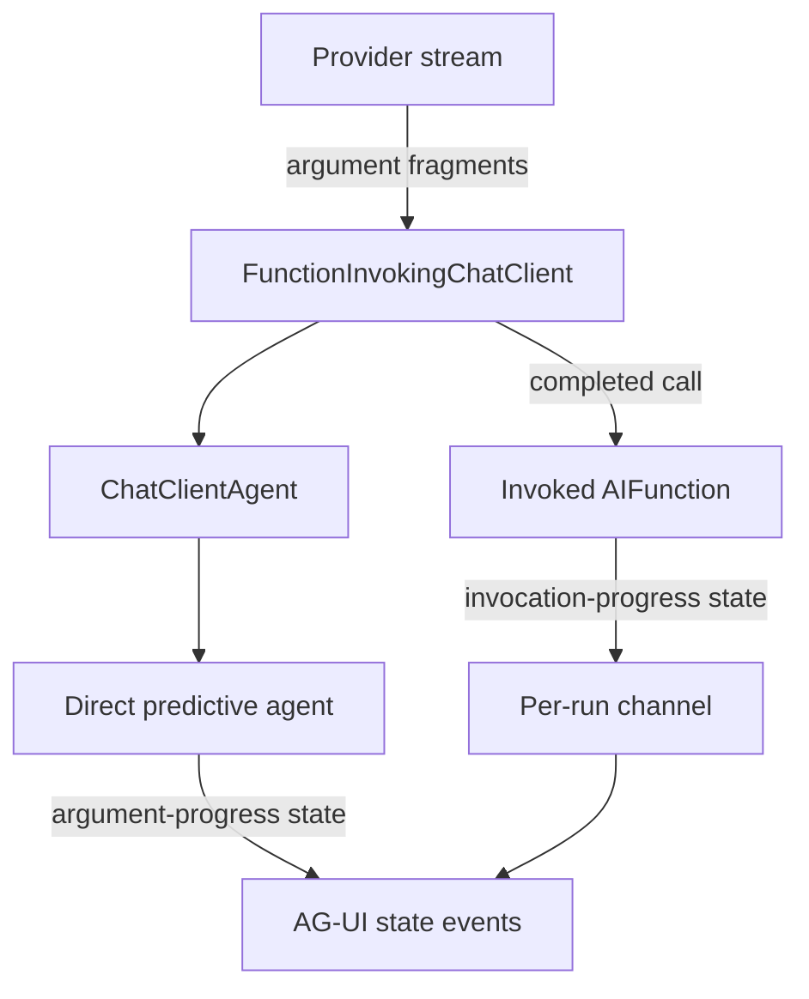

# Predictive state streaming prototypes

This document evaluates application-level approaches for predictive document state through
Microsoft Agent Framework (MAF), Microsoft.Extensions.AI (MEAI), and AG-UI.

## Conclusions

- The OpenAI Chat Completions adapter exposes argument fragments through
  `ChatResponseUpdate.RawRepresentation` before it emits the completed `FunctionCallContent`.
- A delegating agent can convert those fragments into predictive state without a channel.
- Javier's channel approach solves a different problem: publishing UI events from inside a
  function while `FunctionInvokingChatClient` is executing it.
- Completed-call interception cannot provide model-paced predictive state.
- AG-UI 0.0.5 already provides the protocol-level
  `AGUIToolCallArgumentFragment` and `MapStreamingToolCallArguments(...)` primitives.
- The long-term gap is a provider-neutral MEAI representation of streamed function arguments.

## Architectures evaluated



### Direct argument-progress agent

The delegating agent observes the nested provider update carried by
`AgentResponseUpdate.RawRepresentation`, incrementally decodes the `document` argument, and adds
an immediately following application `DataContent` update. `AGUIStreamOptions.MapContent(...)` maps
that data to `StateSnapshotEvent`. The provider update is not mutated, so the stream-only state
content cannot leak into FICC's retained updates or reconstructed history.

The endpoint also registers `MapStreamingToolCallArguments(...)`. This gives AG-UI ownership of
`TOOL_CALL_START`, incremental `TOOL_CALL_ARGS`, and `TOOL_CALL_END`, including closing an open text
or reasoning lane before starting the tool call. The application state snapshot follows the
corresponding tool-argument event.

### Invocation channel

The delegating agent creates a bounded channel per run. The `write_document_local` function closes
over the channel writer and publishes state when FICC invokes the function. A concurrent pump writes
normal inner-agent output to the same channel.

The channel now uses linked cancellation and awaits the pump from a `finally` block, so a client
disconnect does not leave a producer blocked on a full channel.

This is the likely meaning of the workaround discussed in the Dan:Javier sync: a function can
publish a UI event while FICC is still inside its invocation loop. It does not expose partial
arguments before the function is invoked.

### Completed-call informational mapping

This control ignores provider fragments and maps only completed `FunctionCallContent`. It can
produce one state update per complete tool call, but it cannot show a document while its arguments
are being generated.

## Foundry observations

Foundry-backed runs are useful for visual confirmation but not for benchmarking because response
length and provider chunking vary.

- The direct Chat Completions path began rendering several seconds before the completed call.
- The full predictive editor preserved manually entered state, streamed changes, paused for
  confirmation, committed acceptance, and resumed through the inner agent and FICC.
- The invocation-channel path produced a state update only when its function executed. With one
  complete document call, this is not visually progressive.
- The OpenAI Responses adapter produced only the completed-call state in this prototype. The
  Chat-Completions-specific raw extractor did not generalize to Responses.

## Deterministic harness results

The in-app deterministic client forces stream shapes that Foundry cannot reliably produce.

| Case | Direct argument progress | Invocation channel | Finding |
| --- | --- | --- | --- |
| Two sequential calls across FICC iterations | Passed; second document replaced first | Passed | Track calls by identity and reset indexes between turns |
| Two parallel calls in one turn | Both calls correlated and balanced | Both functions executed | Parallel writes to one scalar state have ambiguous last-writer semantics |
| Fragmented emoji and non-ASCII text | Passed | Not applicable | Decoder must retain incomplete escapes and surrogate pairs between fragments |
| Assistant text followed by a tool call | Passed with valid event ordering | Not applicable | AG-UI's streaming argument hook correctly closes the text lane |
| Completed call followed by more provider updates | Client failed | Client failed | FICC can expose an invalid downstream sequence if an adapter emits an FCC before later content |
| Approval-required write | State visible before approval | State visible only after approval and execution | Direct is argument progress; channel is invocation progress |
| Client disconnect | Natural iterator cancellation | Passed after lifecycle hardening | Channel implementations require explicit producer cleanup |
| Responses API | Completed state only | Not evaluated | Provider parity requires an abstraction above provider raw types |

### Early completed-call failure

The forced early-call stream produced this ordering:

```text
TOOL_CALL_START
TOOL_CALL_ARGS
STATE_SNAPSHOT
TOOL_CALL_END
TEXT_MESSAGE_START
TEXT_MESSAGE_CONTENT
TOOL_CALL_RESULT
TEXT_MESSAGE_END
```

The tool result appears while a text message is open. The AG-UI client rejects the sequence. The
current OpenAI Chat Completions adapter normally avoids this because it synthesizes the completed
`FunctionCallContent` only after the provider stream ends, but this is not a general FICC guarantee.

### Approval and streamed arguments

Combining `MapStreamingToolCallArguments(...)` with FICC approval rewriting produced a second
`TOOL_CALL_START` for the same call when the completed call became a `ToolApprovalRequestContent`.
The approval tests therefore disable the streaming argument hook to isolate FICC behavior.

This needs coordination in AG-UI: a call already opened by streamed fragments must be closed and
converted to an approval interrupt without emitting a duplicate lifecycle.

## Recommendation for AgenticUI

Use the direct argument-progress approach for the current Foundry Chat Completions sample:

1. Register an OpenAI extractor with `MapStreamingToolCallArguments(...)`.
2. Incrementally decode the `document` argument in a delegating agent.
3. Emit a separate mapped application state update immediately after the corresponding provider
   update.
4. Throttle intermediate state and always emit the completed call's authoritative value.
5. Preserve the existing confirmation and state-aware continuation behavior.
6. Prevent or define parallel writes to the same scalar state.

Do not use the channel for this specific scenario. A channel is appropriate when state comes from
function execution or another independent producer, but it does not make a single function's
arguments visible before approval or invocation.

The workaround remains provider-specific and should stay on the prototype branch until Javier has
reviewed it. The existing completed-call implementation in PR #2 remains the simpler portable
fallback.

## Remaining application concerns

- Intermediate full snapshots still have cumulative quadratic payload growth. A production version
  should use bounded update frequency and preferably state deltas.
- Raw provider types are not guaranteed to survive caching, replay, persistence, or remote agent
  boundaries.
- The current streaming JSON decoder is deliberately specialized for one string property.
- Parallel calls that update the same document require an explicit conflict policy.
- The sample must define whether predictive state is allowed before approval for consequential
  tools. The document-editing case is safe because the state is provisional until separately
  confirmed.

The corresponding framework proposal is in
[`meai-streaming-function-arguments.md`](meai-streaming-function-arguments.md).
