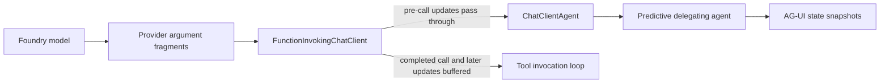

# Predictive state streaming prototypes

This document evaluates application-level workarounds for streaming predictive document state
through Microsoft Agent Framework (MAF), Microsoft.Extensions.AI (MEAI), and AG-UI.

## Goals

- Show document state while the model is still producing `write_document_local` arguments.
- Preserve `FunctionInvokingChatClient` tool execution and conversation history.
- Keep predictive state as an application pattern built from tool updates and UI events.
- Use the result to propose a general MEAI improvement rather than a predictive-state-specific API.

## Pipeline observation

`FunctionInvokingChatClient` does not buffer every provider update. Updates without a completed
`FunctionCallContent` are yielded immediately. When the completed call appears, FICC buffers from
that point until it can resolve server-handled call/result pairs and approval behavior.

OpenAI argument fragments reach callers before the completed call, but only through
`ChatResponseUpdate.RawRepresentation` as `StreamingChatCompletionUpdate.ToolCallUpdates`.
MEAI has no provider-neutral content type for those fragments.



## Prototypes

### Direct delegating agent

The delegating agent inspects the inner `AgentResponseUpdate.RawRepresentation`, extracts nested
OpenAI argument fragments, incrementally decodes the `document` string, and emits
`StateSnapshotEvent` updates before yielding the original agent update.

This preserves one ordered async stream. Backpressure and cancellation flow through the existing
`IAsyncEnumerable` pipeline without additional coordination.

### Delegating agent with channel

A `DelegatingChatClient` below FICC extracts the same fragments and writes state updates to a
bounded per-run channel. A delegating agent pumps normal inner-agent output into the same channel
and yields the merged stream.

This validates the workaround proposed in the Dan:Javier sync. It is useful when updates cannot be
observed above FICC or when an out-of-band producer must continue while the normal agent stream is
buffered.

### Completed-call informational mapping

The delegating agent ignores raw fragments and emits state only when the completed
`FunctionCallContent` appears. This represents interception that lacks access to streamed argument
updates.

## Results

The prototypes used the same Foundry deployment and prompt. Model generation is nondeterministic,
so timing is directional rather than a benchmark.

| Strategy | First state | Final state | State events | Outcome |
| --- | ---: | ---: | ---: | --- |
| Direct delegating agent | 3-5 seconds | 12-13 seconds | About 150 | Progressively updated; full accept continuation passed |
| Channel | About 3 seconds | About 11 seconds | 153 | Progressively updated; cancellation passed |
| Completed-call informational | 11.5 seconds | 11.5 seconds | 1 | No predictive progression |

The direct and channel variants exposed the same provider fragments with no meaningful latency
difference. The channel added a pump, an `AsyncLocal` writer scope, completion coordination, and a
second backpressure boundary without improving the observed result.

The direct prototype also ran through the existing predictive-state UI: the document updated while
arguments streamed, a token from the manually edited starting document was preserved by the model,
the confirmation action paused the run, acceptance committed the prediction, and the confirmation
result resumed through the inner agent and FICC before the model acknowledged the decision.

## Current recommendation

Use the direct delegating-agent approach in the sample for now:

1. Inspect nested provider raw updates before the completed call.
2. Convert the growing `document` argument into throttled state snapshots.
3. Yield those snapshots immediately before the corresponding normal agent update.
4. Emit a final authoritative snapshot from the completed call.
5. Preserve the existing confirmation action and balanced continuation.

Keep the channel implementation as a documented fallback, not the default. It becomes justified if
another provider or pipeline layer stops forwarding pre-call updates, or if state originates from a
truly independent asynchronous producer.

The sample workaround remains provider-specific because it must recognize OpenAI SDK update types.
It should also coalesce updates by time and always emit the final state to avoid quadratic full-state
payload growth.

## MEAI proposal

### Problem

Provider adapters can receive incremental tool-call arguments, but MEAI exposes them only through
provider-specific `RawRepresentation` values. Consumers that need tool progress must depend on a
provider SDK and reconstruct call identity, ordering, and partial arguments themselves.

FICC's buffering of completed calls is intentional and should remain. It is required to detect
server-handled call/result pairs and preserve approval semantics. The missing capability is a typed,
provider-neutral representation of the argument updates that occur before completion.

### Proposed API direction

Add a streaming content type similar to:

```csharp
public sealed class FunctionCallArgumentsDeltaContent : AIContent
{
    public int Index { get; init; }
    public string? CallId { get; init; }
    public string? Name { get; init; }
    public string ArgumentsDelta { get; init; } = string.Empty;
}
```

Provider adapters would emit this content as argument fragments arrive. `CallId` and `Name` may be
present only on the first fragment; `Index` correlates later fragments within the model turn.

`FunctionInvokingChatClient` would:

- Yield delta content immediately.
- Continue accumulating the arguments internally.
- Emit the existing completed `FunctionCallContent`.
- Retain its current buffering and invocation behavior for completed calls, results, and approvals.

### Why this is preferable

- Provider-specific extraction is implemented once in each provider adapter.
- Agent and UI frameworks can observe tool progress without referencing OpenAI types.
- Existing FICC correctness guarantees remain intact.
- AG-UI can map the typed deltas directly to `TOOL_CALL_ARGS`.
- Applications remain responsible for composing predictive state or other UI behavior from general
  tool updates.

### Acceptance criteria

- Argument deltas are observable before the completed `FunctionCallContent`.
- Multiple and parallel calls can be correlated reliably.
- Escaped strings and fragmented Unicode round-trip correctly.
- FICC still produces one completed call and one result per invocation.
- Approval-required and server-handled tools retain current behavior.
- Cancellation terminates both provider streaming and invocation processing.
- Providers that do not support argument streaming remain compatible.

## Open design questions

- Whether the delta should be a string, `BinaryData`, or a new value type.
- Whether call lifecycle needs explicit start/end content in addition to deltas.
- Whether FICC or provider adapters own accumulation into the completed call.
- How typed deltas interact with service-managed conversation history.
- Whether a generic invocation-progress callback is useful after typed content is available.
