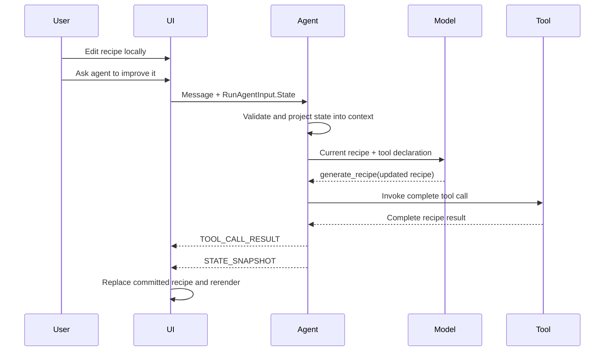

# Shared state: product requirements and design

Status: Draft

## Summary

Shared state lets an application and an agent operate on the same structured, client-visible data.
The client sends its current state with an agent run, and the agent endpoint emits state events when
that state changes.

AG-UI defines the transport:

- `RunAgentInput.State` carries current state from client to agent.
- `STATE_SNAPSHOT` replaces the client-visible state.
- `STATE_DELTA` applies an RFC 6902 JSON Patch.

The application still decides who owns the authoritative state, how it is validated and persisted,
and how conflicting updates are resolved.

Predictive state builds on this foundation. Shared state describes committed values exchanged
between client and agent. Predictive state adds a provisional value that can be rendered before the
authoritative update is complete.

## User scenario

A user and an AI assistant collaboratively edit a structured recipe.

1. The application displays the current recipe.
2. The user edits fields, ingredients, preferences, or instructions directly.
3. The user asks the agent to improve the recipe.
4. The client sends the message and complete current recipe state.
5. The agent uses that state as context and calls `generate_recipe` with an updated recipe.
6. The endpoint emits the complete result as `STATE_SNAPSHOT`.
7. The client replaces its recipe state and renders the changes.
8. The updated state is sent with the next run.

Local and agent edits therefore converge on one client-visible model.

## Requirements

### Product behavior

| Phase | Expected behavior |
| --- | --- |
| Idle | Show committed state and allow local editing |
| Request | Send the latest committed state with the user message |
| Agent processing | Treat client state as context, not trusted instructions |
| State update | Apply a valid snapshot or delta and rerender |
| Failure | Preserve the last valid committed state and show the error |
| Next request | Send the latest state, including local and agent changes |

### Functional and quality requirements

- Define an explicit JSON-serializable state shape.
- Send the complete current state on every run that depends on it.
- Validate client state before using it for prompts, routing, tools, or privileged operations.
- Clearly separate state data from model instructions.
- Emit state only for explicitly selected tools or application events.
- Treat a snapshot as a full replacement and a delta as an ordered patch.
- Ignore or reject malformed state without silently corrupting the current value.
- Preserve state when a run fails or is cancelled before a valid update.
- Prevent local edits that conflict with an active agent update, or define a merge policy.
- Define the authority and persistence model independently of the protocol.
- Avoid putting internal session data, credentials, or provider state in client-visible state.

### Non-goals

- Automatically expose an agent's internal session state.
- Infer shared state from arbitrary tool results.
- Define cross-user collaboration or distributed conflict resolution.
- Stream incomplete state before it is valid; that is the predictive-state extension.
- Replace application persistence with the AG-UI request or event stream.

## Agent and protocol design

### State ownership

The AgenticUI sample uses **client-owned committed state**:

- The Blazor application retains the current recipe.
- Every request includes that recipe in `RunAgentInput.State`.
- The endpoint is stateless with respect to the recipe.
- Agent updates replace the client state through explicit AG-UI events.

This keeps the agent reusable and makes the data flow visible. A production application could
instead store state on the server and send a version or projection to the client, but that requires
application-specific persistence and concurrency rules.

### Protocol lifecycle



The normal chat and tool messages remain in conversation history. Client-visible state travels
separately and is resent when the next model request needs it.

### Snapshots and deltas

Use `STATE_SNAPSHOT` when:

- The state is compact.
- The update replaces most of the object.
- Simplicity and recovery are more important than payload size.

Use `STATE_DELTA` when:

- The application has an established JSON Patch contract.
- Updates are small relative to the state.
- Both client and server validate patch paths and operations.

The recipe sample uses snapshots because the model returns a complete recipe and the state is small.

## Current .NET development experience

### Client

The Blazor page creates `UIAgent<RecipeState>` with an initial recipe. Local edits replace
`AgentState.Value`.

The client attaches current state to each AG-UI request:

```csharp
options.ChatOptions = new ChatOptions
{
    RawRepresentationFactory = _ => new RunAgentInput
    {
        ThreadId = _threadId,
        State = JsonSerializer.SerializeToElement(_agent.State.Value),
    },
};
```

Incoming state is applied explicitly:

```csharp
options.StateMapper = context =>
{
    if (context.Update.RawRepresentation is StateSnapshotEvent snapshot)
    {
        context.SetState(snapshot.Snapshot.Deserialize<RecipeState>()!);
    }
};
```

### Agent

A lightweight `DelegatingAIAgent` reads the originating `RunAgentInput` with
`TryGetRunAgentInput`, confirms the state is a JSON object, and adds it to model context as
user-provided data. A production implementation should deserialize and validate the complete model
before using it.

The agent calls:

```text
generate_recipe(recipe: Recipe) -> RecipeResponse
```

The tool returns the complete updated recipe. Endpoint configuration maps the result:

```csharp
app.MapAGUIServer("/shared_state", agent)
    .WithMetadata(
        new AGUIStreamOptions()
            .MapResultAsStateSnapshot("generate_recipe"));
```

For an incremental committed update, a tool can instead return an RFC 6902 JSON Patch as a
`JsonElement`:

```csharp
app.MapAGUIServer("/planning", agent)
    .WithMetadata(
        new AGUIStreamOptions()
            .MapResultAsStateSnapshot("create_plan")
            .MapResultAsStateDelta("update_plan_step"));
```

`MapResultAsStateDelta` emits the tool result as `STATE_DELTA` after the normal
`TOOL_CALL_RESULT`. It does not calculate a diff or validate patch paths. The tool owns producing a
valid JSON Patch array, and the client owns applying operations in order or rejecting the update.
A common pattern is to establish state with a snapshot and use deltas only for later targeted
changes.

The approach is explicit and flexible, but developers must currently write protocol request
construction, model-context projection, snapshot and delta handling, validation, persistence, and
conflict behavior themselves.

## Python development experience

MAF Python uses `AgentFrameworkAgent` and `state_schema` to describe client-visible state. The
integration reads request state, injects it into model context, supplies empty defaults, and emits
an initial snapshot.

`state_schema` does not automatically turn arbitrary tool results into state. An ordinary
state-producing tool explicitly returns `state_update(state=...)`; the integration merges that
mapping into current state and emits a complete `STATE_SNAPSHOT` after the tool result. Ordinary
shared state does not automatically produce `STATE_DELTA`.

| Concern | Python MAF | Current .NET |
| --- | --- | --- |
| Declare state | `state_schema` | Typed model plus explicit serialization |
| Receive current state | Integration-owned | `RunAgentInput.State` factory |
| Add state to model context | Integration-owned | Delegating agent |
| Commit a tool result | Tool returns `state_update(...)` | Endpoint maps the tool result |
| Emit committed state | Automatic snapshot after `state_update` | Explicit `MapResultAsStateSnapshot` or `MapResultAsStateDelta` |
| Apply state on client | Client state handling | `UIAgent<TState>.StateMapper` |
| Persistence and conflicts | Application-owned | Application-owned |

Predictive configuration is additional to ordinary shared state. `predict_state_config` declares
which streamed tool argument should become provisional state; it is not required merely to exchange
committed state.

Python's ordinary `state_update(...)` path emits a complete snapshot. Its automatic
`STATE_DELTA` support belongs to predictive state, where each partial argument replaces a mapped
state key. .NET uniquely exposes an explicit ordinary committed-delta mapping, although the
application must author the JSON Patch itself.

Python also has an optional thread snapshot-store abstraction. Its in-memory implementation is a
development-oriented whole-record, last-writer-wins cache with no optimistic concurrency.
Separately, `state_update(state=...)` commits use a shallow top-level-key merge; nested dictionaries
are replaced rather than deep-merged. Without a store, as in the AgenticUI sample, the client
remains the source of truth on every request.

Neither implementation automatically validates client state against its declared model before
putting it into model context. Applications must enforce type, size, authorization, and content
constraints.

## Alternatives considered

| Approach | Decision | Reason |
| --- | --- | --- |
| Put state only in chat messages | Reject | Conflates application data with conversation text |
| Automatically emit `AgentSession.StateBag` | Reject | It may contain internal provider or session data |
| Store all state only on the server | Application option | Appropriate for durable authority, but requires IDs, persistence, authorization, and concurrency |
| Send complete client state each run | Recommend for sample | Simple, stateless, and makes the protocol flow visible |
| Map complete tool results to snapshots | Recommend | Fits the complete-recipe tool contract |
| Put state-update protocol code inside each tool | Avoid in .NET | Endpoint mapping keeps tool bodies protocol-neutral |
| Use JSON Patch for every update | Defer | Adds validation and conflict complexity without value for this small state |
| Custom AG-UI endpoint | Reject | Declarative result mapping already covers the scenario |

## Opportunities to improve .NET

The target design should preserve these ownership boundaries:

| Layer | Responsibility |
| --- | --- |
| MEAI | Provider-neutral messages, tools, results, and streaming content |
| AG-UI .NET | Protocol state transport and protocol-level state tracking |
| MAF AG-UI hosting | HTTP handling, agent invocation, sessions, and endpoint configuration |
| Components.AI | Typed UI state, local edits, observation, restore, and predictive state |
| Components.AI/AG-UI integration | Typed state conversion to and from AG-UI requests and events |
| Application | State schema, authorization, persistence, revisions, and conflict policy |

### P0: Fix correctness defects

MAF hosting should save a hosted `AgentSession` from a `finally` block when an SSE client disconnects
or cancels, without using the already-cancelled request token. Otherwise the client can receive tool
and state events while the corresponding server session mutations are lost.

AG-UI .NET should:

- Validate that `STATE_DELTA` is an array consistently across JSON and protobuf.
- Use the already-resolved tool name when mapping results on continuation turns. The current lookup
  can silently omit a configured state event after an approval continuation.
- Handle unset `JsonElement` values without throwing during protocol conversion.
- Leave committed state unchanged when a snapshot cannot be deserialized or a delta cannot be
  applied.
- Log mapper and conversion exceptions server-side while keeping sanitized `RUN_ERROR` messages on
  the wire.

### P1: Close the protocol-level client state loop

`AGUI.Client` should provide one supported implementation for applying snapshots and RFC 6902 deltas.
A possible shape is:

```csharp
public sealed class AGUIStateTracker
{
    public JsonNode? State { get; }

    public AGUIStateApplyResult Apply(ChatResponseUpdate update);
}
```

One tracker would be scoped to one thread. Updates should be applied to a copy and committed
atomically so a malformed patch cannot partially corrupt the previous state. Request construction
should remain with the caller, which assigns the tracked value to `RunAgentInput.State`.

State events should also be represented as serializable `AIContent` on
`ChatResponseUpdate.Contents`, not only as provider objects in `RawRepresentation`. Durable content
allows conversation restore to recover state and gives typed clients a normal content-mapping path.
This is more important to shared state than changing `ChatResponseUpdate.ToChatResponse`
aggregation semantics.

The trim-safe client path should apply patches over `JsonNode`. Server-side patch authoring can reuse
`Microsoft.AspNetCore.JsonPatch.SystemTextJson` where its target frameworks and reflection behavior
are acceptable rather than introducing a competing JSON Patch model.

### P1: Make Components.AI state symmetric and typed

`UIAgent<TState>` receives typed state but has no corresponding outbound-state API. The committed
`AgentState<TState>.Value` should be the single source of truth sent by default, never an unconfirmed
prediction. An optional projection or redaction callback can produce the client-visible form.

Extend the existing options and constructor surface without hiding the current non-generic
`StateMapper`. Add a generic mapping context, `JsonTypeInfo<TState>`, default snapshot handling, and
helpers for applying committed and predictive deltas. A separate Components.AI/AG-UI integration can
translate the committed value to `RunAgentInput.State` and map durable AG-UI state content back to
typed state, removing protocol casts from Razor pages.

Persist committed typed state independently of `RawRepresentation`. Restoring a serialized
conversation currently cannot reconstruct state from provider objects and can reset state to
`new TState()`. The persistence contract should either store state with the conversation thread or
use an application state store keyed by the stable AG-UI `ThreadId`.

### P1: Remove the application-authored `DelegatingAIAgent`

State injection is invocation context, so the preferred long-term MAF extension point is
`AIContextProvider`. MAF already has an `AgentRunContext` containing the run options when it invokes
providers, but `AIContextProvider.InvokingContext` does not expose it. Add the run context through a
non-breaking constructor overload and property.

An AG-UI integration can then offer an agent-builder helper that deserializes and validates client
state with `JsonTypeInfo<TState>` and lets application policy choose prompt role, framing, ordering,
and token budget. This is preferable to an endpoint-level `WithClientStateContext<TState>` API that
would combine transport deserialization with model-prompt decisions.

As an interim solution, applications can use existing `AIAgentBuilder` middleware to inspect
`AgentRunOptions` without authoring a `DelegatingAIAgent`. The AG-UI SDK could also add an
`AgentRunOptions` overload for its existing `TryGetRunAgentInput` helper rather than adding
overlapping input and state helpers.

### P1: Make endpoint stream configuration discoverable and composable

Replace the documented metadata mechanism:

```csharp
.WithMetadata(new AGUIStreamOptions().MapResultAsStateSnapshot("generate_recipe"))
```

with a hosting-specific convention:

```csharp
.WithAGUIStreamOptions(options =>
    options.MapResultAsStateSnapshot("generate_recipe"))
```

Today endpoint metadata replaces globally configured options, and multiple metadata instances do
not compose because endpoint lookup selects one. The convention should store immutable
configuration callbacks, create fresh request options, apply global DI configuration first, and
then apply endpoint callbacks in registration order. It must not capture request-specific mutable
state in endpoint metadata.

### P2: Improve typed server mapping, security, and diagnostics

Keep domain tools protocol-neutral. Consider AOT-safe `JsonTypeInfo<T>` overloads for reading
`RunAgentInput.State` and mapping typed results, for example:

```csharp
options.MapResultAsStateSnapshot(
    "generate_recipe",
    AppJsonContext.Default.RecipeResponse);
```

This is lower priority because the existing general `MapResult` API can already perform custom
conversion.

Document that `RunAgentInput.State` is untrusted client-visible data, while
`AgentSession.StateBag` is internal session data and must not be emitted automatically.
Applications should validate shape, size, authorization, and schema version. A durable application
can carry a revision or ETag inside its own state model, reject stale updates, and send a replacement
snapshot when a delta cannot be applied.

`ThreadId`, `RunId`, and `ParentRunId` are continuity and correlation values, not authorization
credentials or concurrency tokens. Server-owned state requires separate authorization and a
correctly scoped isolation provider; an application revision must provide conflict detection.

Components.AI should report state receipt, application, rejection, restoration, and delta failures
through `UIAgentLog`; expose committed and current values separately; define whether
`AgentState<T>.OnChanged` marshals to the renderer synchronization context; use source-generated
serialization; and cover WebAssembly and Auto render modes.

AG-UI .NET should add direct tests for snapshot and delta mappings, including continuation calls,
invalid result types, malformed deltas, and both transports. It should also document that raw
`BaseEvent` passthrough ignores other update content and does not close open text or reasoning
lanes.

### MEAI boundary

MEAI should not add shared-state concepts. Its existing content, result, property, and
raw-representation primitives are sufficient. MEAI should clarify that durable side-band data
belongs in serializable `AIContent`, while `RawRepresentation` is for streaming/provider objects.
Provider-neutral streamed function arguments remain a separate predictive-state proposal.

### Samples and documentation

Extend the existing Components.AI Dojo shared-state scenario and promote it to a documented,
.NET-to-.NET multi-turn sample. It should set and reuse `ThreadId`; receive, validate, and inject
client state; emit and apply snapshots and deltas; resend committed state; demonstrate failed-delta
recovery with a resynchronizing snapshot; and explain client state versus session state and
client-owned versus server-owned authority.

## Relationship to predictive state

Shared state establishes:

- The JSON state model.
- Client-to-agent transport.
- Agent-to-client state events.
- Committed state ownership.
- Persistence and conflict policy.

Predictive state adds:

- Mapping incomplete tool arguments to provisional state.
- A baseline for rollback.
- Final reconciliation with completed arguments.
- Optional confirmation before commit.

The shared-state design should therefore be implemented and understood first. Predictive state is
an optimistic rendering layer over the same committed-state lifecycle.

## References

- [MAF state management with AG-UI](https://learn.microsoft.com/en-us/agent-framework/integrations/by-component/ui/ag-ui/state-management)
- [Predictive-state companion design](predictive-state-product-requirements-and-design.md)
