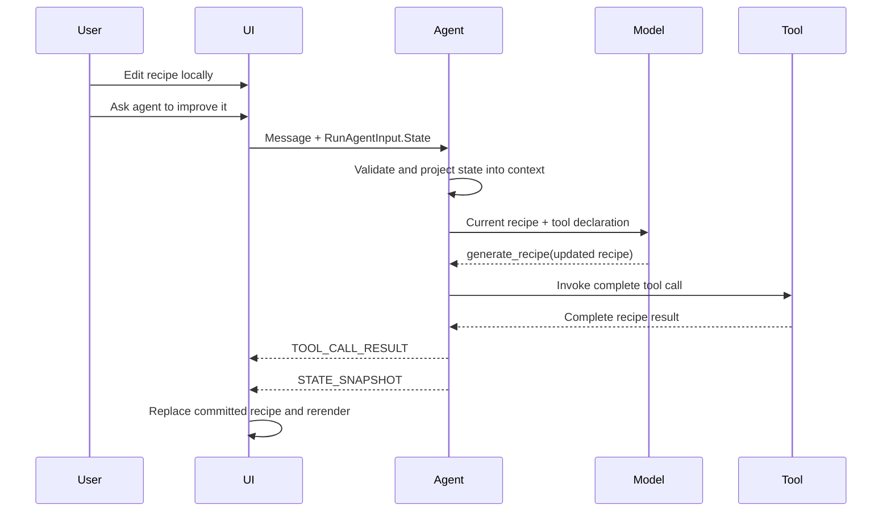

# Shared state: product requirements and design

Status: Draft

## Summary

Shared state lets an application and an agent operate on the same structured, client-visible data.
The client sends its current state with an agent run, and the agent endpoint emits state events when
that state changes.

AG-UI defines the transport:

- `RunAgentInput.State` carries current state from client to agent.
- `STATE_SNAPSHOT` replaces the client-visible state.
- `STATE_DELTA` applies an RFC 6902 JSON Patch.

The application still decides who owns the authoritative state, how it is validated and persisted,
and how conflicting updates are resolved.

Predictive state builds on this foundation. Shared state describes committed values exchanged
between client and agent. Predictive state adds a provisional value that can be rendered before the
authoritative update is complete.

## User scenario

A user and an AI assistant collaboratively edit a structured recipe.

1. The application displays the current recipe.
2. The user edits fields, ingredients, preferences, or instructions directly.
3. The user asks the agent to improve the recipe.
4. The client sends the message and complete current recipe state.
5. The agent uses that state as context and calls `generate_recipe` with an updated recipe.
6. The endpoint emits the complete result as `STATE_SNAPSHOT`.
7. The client replaces its recipe state and renders the changes.
8. The updated state is sent with the next run.

Local and agent edits therefore converge on one client-visible model.

## Requirements

### Product behavior

| Phase | Expected behavior |
| --- | --- |
| Idle | Show committed state and allow local editing |
| Request | Send the latest committed state with the user message |
| Agent processing | Treat client state as context, not trusted instructions |
| State update | Apply a valid snapshot or delta and rerender |
| Failure | Preserve the last valid committed state and show the error |
| Next request | Send the latest state, including local and agent changes |

### Functional and quality requirements

- Define an explicit JSON-serializable state shape.
- Send the complete current state on every run that depends on it.
- Validate client state before using it for prompts, routing, tools, or privileged operations.
- Clearly separate state data from model instructions.
- Emit state only for explicitly selected tools or application events.
- Treat a snapshot as a full replacement and a delta as an ordered patch.
- Ignore or reject malformed state without silently corrupting the current value.
- Preserve state when a run fails or is cancelled before a valid update.
- Prevent local edits that conflict with an active agent update, or define a merge policy.
- Define the authority and persistence model independently of the protocol.
- Avoid putting internal session data, credentials, or provider state in client-visible state.

### Non-goals

- Automatically expose an agent's internal session state.
- Infer shared state from arbitrary tool results.
- Define cross-user collaboration or distributed conflict resolution.
- Stream incomplete state before it is valid; that is the predictive-state extension.
- Replace application persistence with the AG-UI request or event stream.

## Agent and protocol design

### State ownership

The AgenticUI sample uses **client-owned committed state**:

- The Blazor application retains the current recipe.
- Every request includes that recipe in `RunAgentInput.State`.
- The endpoint is stateless with respect to the recipe.
- Agent updates replace the client state through explicit AG-UI events.

This keeps the agent reusable and makes the data flow visible. A production application could
instead store state on the server and send a version or projection to the client, but that requires
application-specific persistence and concurrency rules.

### Protocol lifecycle



The normal chat and tool messages remain in conversation history. Client-visible state travels
separately and is resent when the next model request needs it.

### Snapshots and deltas

Use `STATE_SNAPSHOT` when:

- The state is compact.
- The update replaces most of the object.
- Simplicity and recovery are more important than payload size.

Use `STATE_DELTA` when:

- The application has an established JSON Patch contract.
- Updates are small relative to the state.
- Both client and server validate patch paths and operations.

The recipe sample uses snapshots because the model returns a complete recipe and the state is small.

## Current .NET development experience

### Client

The Blazor page creates `UIAgent<RecipeState>` with an initial recipe. Local edits replace
`AgentState.Value`.

The client attaches current state to each AG-UI request:

```csharp
options.ChatOptions = new ChatOptions
{
    RawRepresentationFactory = _ => new RunAgentInput
    {
        State = JsonSerializer.SerializeToElement(_agent.State.Value),
    },
};
```

Incoming state is applied explicitly:

```csharp
options.StateMapper = context =>
{
    if (context.Update.RawRepresentation is StateSnapshotEvent snapshot)
    {
        context.SetState(snapshot.Snapshot.Deserialize<RecipeState>()!);
    }
};
```

### Agent

A lightweight `DelegatingAIAgent` reads the originating `RunAgentInput` with
`TryGetRunAgentInput`, confirms the state is a JSON object, and adds it to model context as
user-provided data. A production implementation should deserialize and validate the complete model
before using it.

The agent calls:

```text
generate_recipe(recipe: Recipe) -> RecipeResponse
```

The tool returns the complete updated recipe. Endpoint configuration maps the result:

```csharp
app.MapAGUIServer("/shared_state", agent)
    .WithMetadata(
        new AGUIStreamOptions()
            .MapResultAsStateSnapshot("generate_recipe"));
```

### Current .NET developer responsibilities

- Define matching client and server state models.
- Update typed state for local edits.
- Construct protocol-specific `RunAgentInput` through `RawRepresentationFactory`.
- Recover state in a delegating agent and apply application validation.
- Decide how state enters model context.
- Configure selected tool results as snapshots or deltas.
- Deserialize and apply incoming state.
- Implement persistence and conflict behavior.

The approach is explicit and flexible, but outbound state and model-context projection require
boilerplate that is easy to omit.

## Python development experience

MAF Python uses `AgentFrameworkAgent` and `state_schema` to describe client-visible state. The
integration reads request state, injects it into model context, supplies empty defaults, and emits
an initial snapshot.

`state_schema` does not automatically turn arbitrary tool results into state. An ordinary
state-producing tool explicitly returns `state_update(state=...)`; the integration merges that
mapping into current state and emits a complete `STATE_SNAPSHOT` after the tool result. Ordinary
shared state does not automatically produce `STATE_DELTA`.

| Concern | Python MAF | Current .NET |
| --- | --- | --- |
| Declare state | `state_schema` | Typed model plus explicit serialization |
| Receive current state | Integration-owned | `RunAgentInput.State` factory |
| Add state to model context | Integration-owned | Delegating agent |
| Commit a tool result | Tool returns `state_update(...)` | Endpoint maps the tool result |
| Emit committed state | Automatic snapshot after `state_update` | Explicit `AGUIStreamOptions` snapshot or delta |
| Apply state on client | Client state handling | `UIAgent<TState>.StateMapper` |
| Persistence and conflicts | Application-owned | Application-owned |

Predictive configuration is additional to ordinary shared state. `predict_state_config` declares
which streamed tool argument should become provisional state; it is not required merely to exchange
committed state.

Python also has an optional thread snapshot-store abstraction. Its in-memory implementation is a
development-oriented whole-record, last-writer-wins cache with no optimistic concurrency.
Separately, `state_update(state=...)` commits use a shallow top-level-key merge; nested dictionaries
are replaced rather than deep-merged. Without a store, as in the AgenticUI sample, the client
remains the source of truth on every request.

Neither implementation automatically validates client state against its declared model before
putting it into model context. Applications must enforce type, size, authorization, and content
constraints.

## Alternatives considered

| Approach | Decision | Reason |
| --- | --- | --- |
| Put state only in chat messages | Reject | Conflates application data with conversation text |
| Automatically emit `AgentSession.StateBag` | Reject | It may contain internal provider or session data |
| Store all state only on the server | Application option | Appropriate for durable authority, but requires IDs, persistence, authorization, and concurrency |
| Send complete client state each run | Recommend for sample | Simple, stateless, and makes the protocol flow visible |
| Map complete tool results to snapshots | Recommend | Fits the complete-recipe tool contract |
| Put state-update protocol code inside each tool | Avoid in .NET | Endpoint mapping keeps tool bodies protocol-neutral |
| Use JSON Patch for every update | Defer | Adds validation and conflict complexity without value for this small state |
| Custom AG-UI endpoint | Reject | Declarative result mapping already covers the scenario |

## Opportunities to improve .NET

### Components.AI

Add a symmetric outbound-state callback to `UIAgent<TState>`:

```csharp
options.StateProvider = () => _agent.State.Value;
```

The AG-UI client integration could serialize that value into `RunAgentInput.State`, removing direct
protocol construction from the page.

### MAF AG-UI hosting

Remove the need for an application-authored `DelegatingAIAgent`. `MapAGUIServer` already receives
the originating `RunAgentInput`, so the endpoint should provide an explicit typed projection from
client state into model context:

```csharp
app.MapAGUIServer("/shared_state", agent)
    .WithClientStateContext<RecipeState>(
        state => new ChatMessage(
            ChatRole.User,
            $"Current recipe JSON:\n{JsonSerializer.Serialize(state)}"));
```

The hosting layer should deserialize `RunAgentInput.State`, invoke the callback only when state is
present and valid, and add the resulting message or `AIContext` for that run before invoking the
agent. The callback keeps prompt framing explicit while removing `TryGetRunAgentInput`,
`ChatClientAgentRunOptions` inspection, and a custom wrapper type from application code.

The helper must not automatically expose `AgentSession.StateBag` or infer that all request state
belongs in the prompt. Client state is untrusted input, so deserialization errors and application
validation failures should be surfaced rather than silently ignored.

Hide the endpoint-metadata implementation used to associate `AGUIStreamOptions` with
`MapAGUIServer`. The current documentation tells developers to call the general ASP.NET Core
`WithMetadata` method without explaining that the AG-UI handler later retrieves that specific
metadata type.

Provide a feature-specific endpoint extension instead:

```csharp
app.MapAGUIServer("/shared_state", agent)
    .WithAGUIStreamOptions(options =>
        options.MapResultAsStateSnapshot("generate_recipe"));
```

`WithAGUIStreamOptions` should create one endpoint-scoped `AGUIStreamOptions` instance, attach it as
metadata, and return the same endpoint-builder type for fluent chaining. This makes the supported
configuration path discoverable while leaving `WithMetadata` as the low-level mechanism. Because
endpoint metadata is created at startup and reused, the API documentation should also warn against
capturing per-run mutable state in mapping callbacks.

### AG-UI .NET

Improve typed result mapping so a POCO tool result can become a snapshot without first being
manually converted to `JsonElement`:

```csharp
new AGUIStreamOptions()
    .MapResultAsStateSnapshot<RecipeResponse>("generate_recipe");
```

### State consistency

For durable applications, define optional application-level metadata such as a state version or
ETag. The server can reject an update based on stale client state rather than silently overwriting a
newer value. This is an application convention unless AG-UI standardizes versioned state later.

## Relationship to predictive state

Shared state establishes:

- The JSON state model.
- Client-to-agent transport.
- Agent-to-client state events.
- Committed state ownership.
- Persistence and conflict policy.

Predictive state adds:

- Mapping incomplete tool arguments to provisional state.
- A baseline for rollback.
- Final reconciliation with completed arguments.
- Optional confirmation before commit.

The shared-state design should therefore be implemented and understood first. Predictive state is
an optimistic rendering layer over the same committed-state lifecycle.

## References

- [MAF state management with AG-UI](https://learn.microsoft.com/en-us/agent-framework/integrations/by-component/ui/ag-ui/state-management)
- [Predictive-state companion design](predictive-state-product-requirements-and-design.md)
